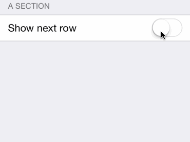
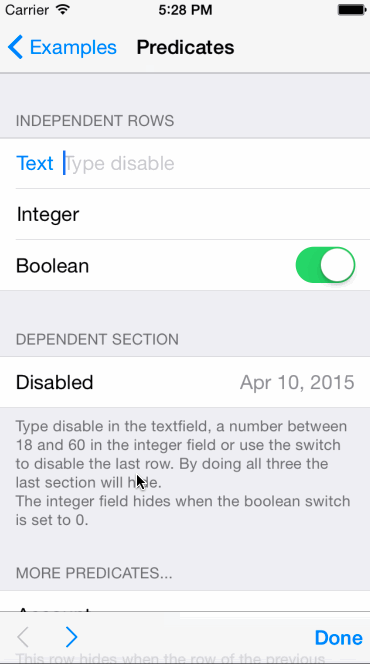

XLForm
---------------

By [XMARTLABS](http://xmartlabs.com).

[](https://travis-ci.org/xmartlabs/XLForm)
<a href="https://cocoapods.org/pods/XLForm"></a>

**如果你正在使用 Swift 编程语言，那么你应该看看 [Eureka](https://github.com/xmartlabs/Eureka)，它是 XLForm 的 Swift 版本，并且有更多的功能特性。** 

我们不会再为 XLForm 添加任何新特性，但是，如果出现关键问题，我们将修复它。


目的
--------------

XLForm 是一个创建动态 table-view 表单的非常灵活、强大的 iOS 库。此库被设计的目的是让你花费十分之一的时间便可得到和手写代码相同效果的表单页面。

XLForm 提供了一个非常强大的 DSL（Domain Specific Language，领域特定语言）用于创建表单。它会在运行时（runtime）持续跟踪此规范，动态更新 UI。

##### 让我们看一个使用 XLForm 创建 iOS 日历表单的示例


XLForm 可以做什么
----------------

* 根据[*表单定义*](#如何创建一个表单 "form definition")的描述加载一个表单。
* 跟踪运行时（runtime）表单定义的更新，并相应更新 UI 界面。详细部分见此文档的[*动态表单*](#dynamic-forms---how-to-change-the-form-dynamically-at-runtime "Dynamic Forms")章节。
* 支持对多个 section 中的 row 行进行创建、删除或者重新排序。详细描述见[*多个 Section*](#multivalued-sections-insert-delete-reorder-rows "Multivalued Sections")章节。
* 支持[*自定义 row*](#how-to-create-a-custom-row)。
* 支持自定义选择器。关于如何自定义选择器的详细描述见[*自定义选择器*](#custom-selectors---selector-row-with-a-custom-selector-view-controller "Custom Selectors")部分。
* 提供多个内联选择器，例如日期选择器和内联选择器，并提供创建自定义内联选择器的方法。
* 基于表单定义的表单数据校验机制。
* 能够轻松地在 row 行之间导航，完全可定制。
* 根据需要显示输入辅助视图（`inputAccessoryView`，即虚拟键盘上方的工具条）。默认情况下显示导航输入辅助视图。
* 支持对特定的 row  行或者整个表单设置为只读模式。
* 一个或多个 row  行可以根据其它 row 行的值显示或隐藏。这个特性可以通过声明使用 `NSPredicates` 实现。 (详见 [*Make a row or section invisible depending on other rows values*](#make-a-row-or-section-invisible-depending-on-other-rows-values "Using Predicates"))


## 如何创建一个表单

#### 创建 XLFormViewController 实例对象

##### Swift

```swift
class CalendarEventFormViewController : XLFormViewController {

  required init(coder aDecoder: NSCoder) {
    super.init(coder: aDecoder)
    self.initializeForm()
  }

  override init(nibName nibNameOrNil: String?, bundle nibBundleOrNil: NSBundle?) {
    super.init(nibName: nibNameOrNil, bundle: nibBundleOrNil)
    self.initializeForm()
  }

  func initializeForm() {
    // Implementation details covered in the next section.
  }

}
```

##### Objective-C

```objc
#import "XLFormViewController.h"

@interface CalendarEventFormViewController: XLFormViewController

@end
```

```objc
@interface ExamplesFormViewController ()

@end

@implementation ExamplesFormViewController

- (instancetype)initWithNibName:(NSString *)nibNameOrNil bundle:(NSBundle *)nibBundleOrNil {
    self = [super initWithNibName:nibNameOrNil bundle:nibBundleOrNil];
    if (self){
        [self initializeForm];
    }
    return self;
}

- (id)initWithCoder:(NSCoder *)aDecoder {
    self = [super initWithCoder:aDecoder];
    if (self){
        [self initializeForm];
    }
    return self;
}

- (void)initializeForm {
  // Implementation details covered in the next section.
}

@end
```

##### 实现 initializeForm 方法

我们需要使用 `XLFormDescriptor` 实例来创建表单，并且把它赋值给 `XLFormViewController` 实例。正如我们所说的那样，XLForm 基于 DSL 运行，它隐藏了复杂和样板式的代码而不失手写代码的强大和灵活性。

要定义一个表单，我们使用这三个类:

 * `XLFormDescriptor`，用于创建 Form；
 * `XLFormSectionDescriptor`，用于创建 Section；
 * `XLFormRowDescriptor`，用于创建 Row；

`XLFormDescriptor` 实例用来定义表单，一个表单包含了一个或多个段（`XLFormSectionDescriptor`实例）。而每一个段可以包含一个或多个行（`XLFormRowDescriptor`实例）。你可能已经注意到 DSL 结构类似于 `UITableView` 的结构 (Table -->> Sections -- >> Rows)。最终 table-view 的表单结构（section 和 row 的顺序）取决于定义时的代码顺序。

##### 让我们看一个 `initializeForm` 的示例代码来定义并实现 iOS 日历表单

```objc
- (void)initializeForm {
  XLFormDescriptor * form;
  XLFormSectionDescriptor * section;
  XLFormRowDescriptor * row;

  form = [XLFormDescriptor formDescriptorWithTitle:@"Add Event"];

  // 第一段
  section = [XLFormSectionDescriptor formSection];
  [form addFormSection:section];

  // 标题行
  row = [XLFormRowDescriptor formRowDescriptorWithTag:@"title" rowType:XLFormRowDescriptorTypeText];
  [row.cellConfigAtConfigure setObject:@"Title" forKey:@"textField.placeholder"];
  [section addFormRow:row];

  // 位置行
  row = [XLFormRowDescriptor formRowDescriptorWithTag:@"location" rowType:XLFormRowDescriptorTypeText];
  [row.cellConfigAtConfigure setObject:@"Location" forKey:@"textField.placeholder"];
  [section addFormRow:row];

  // 第二段
  section = [XLFormSectionDescriptor formSection];
  [form addFormSection:section];

  // All-day
  row = [XLFormRowDescriptor formRowDescriptorWithTag:@"all-day" rowType:XLFormRowDescriptorTypeBooleanSwitch title:@"All-day"];
  [section addFormRow:row];

  // 开始时间
  row = [XLFormRowDescriptor formRowDescriptorWithTag:@"starts" rowType:XLFormRowDescriptorTypeDateTimeInline title:@"Starts"];
  row.value = [NSDate dateWithTimeIntervalSinceNow:60*60*24];
  [section addFormRow:row];

  self.form = form;
}
```

XLForm 会从以上定义的代码中加载 table-view 表单。最有趣的部分是它会根据表单定义的修改更新表单 UI。
这意味着我们可以在运行时（runtime）对 table-view 表单进行修改：在表单定义中添加或移除 section 或者 row。并且你不需要再去关心`NSIndexPath`, `UITableViewDelegate`, `UITableViewDataSource` 或者其它复杂的东西。

**要查看更多复杂的表单定义请参见此存储库 Examples 文件夹中的示例应用程序。你也可以根据自己的喜好在你自己的设备上运行示例应用。**XLForm **没有依赖**其它框架，此示例应用中使用的某些库只是为了显示 XLForm 特性。

## 在 Storyboards 上使用 XLForm

* 执行以上**如何创建一个表单**的步骤；
* 在 Interface Builder (IB) 中，拖放一个 **UIViewController** 到 Storyboard 上；
* 使用 **Identity Inspector** 关联你自定义的类到 **UIViewController** 上。

如何运行 XLForm 示例
---------------------------------

1. 克隆 `git@github.com:xmartlabs/XLForm.git` 存储库。你也可以用你自己的 github 账户 fork 此仓库，这种方法在你想做出贡献的情况下会更好。
2. 移动到 Objective-C 或 Swift 中的任何一个 [example folder](/Examples).
3. 在 Objective-C 或 Swift 示例文件夹中运行`pod install`，以安装示例项目中的 cocoapod 依赖。
4. 使用 Xcode 打开 XLForm 或 SwiftExample 的 workspace 文件，并运行该项目。享受吧！


Rows 行
---------------------
#### 输入行


输入行允许用户输入文本信息。基本上他们会使用 `UITextField` 或者 `UITextView` 控件。输入行之间的主要区别是 `keyboardType` 键盘类型，`autocorrectionType` 自动更正类型和 `autocapitalizationType` 自动大小写类型配置。

```objc
static NSString *const XLFormRowDescriptorTypeText = @"text";
```
将用 `UITextField` 表示，它的属性被设置为 `UITextAutocorrectionTypeDefault`、`UITextAutocapitalizationTypeSentences`和`UIKeyboardTypeDefault`。

```objc
static NSString *const XLFormRowDescriptorTypeName = @"name";
```
将用 `UITextField` 表示，它的属性被设置为 `UITextAutocorrectionTypeNo`、`UITextAutocapitalizationTypeWords`和`UIKeyboardTypeDefault`。

```objc
static NSString *const XLFormRowDescriptorTypeURL = @"url";
```
将用 `UITextField` 表示，它的属性被设置为 `UITextAutocorrectionTypeNo`、`UITextAutocapitalizationTypeNone`和`UIKeyboardTypeURL`。

```objc
static NSString *const XLFormRowDescriptorTypeEmail = @"email";
```
将用 `UITextField` 表示，它的属性被设置为 `UITextAutocorrectionTypeNo`、`UITextAutocapitalizationTypeNone`和`UIKeyboardTypeEmailAddress`。

```objc
static NSString *const XLFormRowDescriptorTypePassword = @"password";
```
将用 `UITextField` 表示，它的属性被设置为 `UITextAutocorrectionTypeNo`、`UITextAutocapitalizationTypeNone`和`UIKeyboardTypeASCIICapable`。
该类型还会将 `secureTextEntry` 设置为 `YES`，以隐藏用户输入的内容。

```objc
static NSString *const XLFormRowDescriptorTypeNumber = @"number";
```
将用 `UITextField` 表示，它的属性被设置为 `UITextAutocorrectionTypeNo`、`UITextAutocapitalizationTypeNone`和`UIKeyboardTypeNumbersAndPunctuation`。

```objc
static NSString *const XLFormRowDescriptorTypePhone = @"phone";
```
将用 `UITextField` 表示，它的属性被设置为 `UIKeyboardTypePhonePad`。

```objc
static NSString *const XLFormRowDescriptorTypeTwitter = @"twitter";
```
将用 `UITextField` 表示，它的属性被设置为 `UITextAutocorrectionTypeNo`、`UITextAutocapitalizationTypeNone`和`UIKeyboardTypeTwitter`。

```objc
static NSString *const XLFormRowDescriptorTypeAccount = @"account";
```
将用 `UITextField` 表示，它的属性被设置为 `UITextAutocorrectionTypeNo`、`UITextAutocapitalizationTypeNone`和`UIKeyboardTypeDefault`。

```objc
static NSString *const XLFormRowDescriptorTypeInteger = @"integer";
```
将用 `UITextField` 表示，它的属性被设置为 `UIKeyboardTypeNumberPad`。

```objc
static NSString *const XLFormRowDescriptorTypeDecimal = @"decimal";
```
将用 `UITextField` 表示，它的属性被设置为 `UIKeyboardTypeDecimalPad`。

```objc
static NSString *const XLFormRowDescriptorTypeTextView = @"textView";
```
将用 `UITextView` 表示，它的属性被设置为 `UITextAutocorrectionTypeDefault`、`UITextAutocapitalizationTypeSentences`和`UIKeyboardTypeDefault`。


#### 选择器行

选择器行允许我们从一个列表中选择一个或多个值。XLForm 支持 8 种类型的选择器行。


```objc
static NSString *const XLFormRowDescriptorTypeSelectorPush = @"selectorPush";
```

```objc
static NSString *const XLFormRowDescriptorTypeSelectorActionSheet = @"selectorActionSheet";
```

```objc
static NSString *const XLFormRowDescriptorTypeSelectorAlertView = @"selectorAlertView";
```

```objc
static NSString *const XLFormRowDescriptorTypeSelectorLeftRight = @"selectorLeftRight";
```

```objc
static NSString *const XLFormRowDescriptorTypeSelectorPickerView = @"selectorPickerView";
```

```objc
static NSString *const XLFormRowDescriptorTypeSelectorPickerViewInline = @"selectorPickerViewInline";
```

```objc
static NSString *const XLFormRowDescriptorTypeSelectorSegmentedControl = @"selectorSegmentedControl";
```

```objc
static NSString *const XLFormRowDescriptorTypeMultipleSelector = @"multipleSelector";
```


通常我们会有一个对象集合来选择（这些对象应该有用于显示的字符串和用于排序的值），XLForm 可以展示这些对象。

XLForm 遵循以下规则来展示对象：

1. 如果 `XLFormRowDescriptor` 对象的 `value` 为 `nil`，XLForm 使用 `noValueDisplayText` 属性的值作为展示内容。
2. 如果 `XLFormRowDescriptor` 实例有一个 `valueTransformer` 属性值，XLForm 使用 `NSValueTransformer` 将被选择的对象转换为 `NSString` 字符串。
3. 如果对象是 `NSString` 或者 `NSNumber`，则默认使用该对象的 `description` 属性。
4. 如果对象遵守 `XLFormOptionObject` 协议，XLForm 从 `formDisplayText`  方法中得到要显示的值。
5. 另外，如果它返回 `nil`，这就意味着你应该遵守协议`:)`。


你可能会对通过设置 `noValueDisplayText`  或者  `valueTransformer`  属性或者让选择器对象遵守 `XLFormOptionObject` 协议感兴趣。


这是协议的声明:

```objc
@protocol XLFormOptionObject <NSObject>

@required
// 该方法返回要显示的值
-(NSString *)formDisplayText;
// 该方法返回原始值
-(id)formValue;

@end
```


#### 日期和时间行

XLForms 支持 3 种类型的日期：`Date`、`DateTime`、`Time`  和  `Countdown Timer` ，而且它可以用两种不同的方式（内嵌\非内嵌）来展示 `UIDatePicker` 控制器。


```objc
static NSString *const XLFormRowDescriptorTypeDateInline = @"dateInline";
```

```objc
static NSString *const XLFormRowDescriptorTypeDateTimeInline = @"datetimeInline";
```

```objc
static NSString *const XLFormRowDescriptorTypeTimeInline = @"timeInline";
```

```objc
static NSString *const XLFormRowDescriptorTypeCountDownTimerInline = @"countDownTimerInline";
```

```objc
static NSString *const XLFormRowDescriptorTypeDate = @"date";
```

```objc
static NSString *const XLFormRowDescriptorTypeDateTime = @"datetime";
```

```objc
static NSString *const XLFormRowDescriptorTypeTime = @"time";
```

```objc
static NSString *const XLFormRowDescriptorTypeCountDownTimer = @"countDownTimer";
```

以下是如何定义这些行类型的示例：

**Objective C**
```objc
XLFormDescriptor * form;
XLFormSectionDescriptor * section;
XLFormRowDescriptor * row;

form = [XLFormDescriptor formDescriptorWithTitle:@"Dates"];

section = [XLFormSectionDescriptor formSectionWithTitle:@"Inline Dates"];
[form addFormSection:section];

// Date 日期
row = [XLFormRowDescriptor formRowDescriptorWithTag:kDateInline rowType:XLFormRowDescriptorTypeDateInline title:@"Date"];
row.value = [NSDate new];
[section addFormRow:row];

// Time 时间
row = [XLFormRowDescriptor formRowDescriptorWithTag:kTimeInline rowType:XLFormRowDescriptorTypeTimeInline title:@"Time"];
row.value = [NSDate new];
[section addFormRow:row];

// DateTime 日期+时间
row = [XLFormRowDescriptor formRowDescriptorWithTag:kDateTimeInline rowType:XLFormRowDescriptorTypeDateTimeInline title:@"Date Time"];
row.value = [NSDate new];
[section addFormRow:row];

// CountDownTimer 倒计时器
row = [XLFormRowDescriptor formRowDescriptorWithTag:kCountDownTimerInline rowType:XLFormRowDescriptorTypeCountDownTimerInline title:@"Countdown Timer"];
row.value = [NSDate new];
[section addFormRow:row];
```

**Swift**
```Swift

static let dateTime = "dateTime"
static let date = "date"
static let time = "time"

var form : XLFormDescriptor
var section : XLFormSectionDescriptor
var row : XLFormRowDescriptor

form = XLFormDescriptor(title: "Dates") as XLFormDescriptor

section = XLFormSectionDescriptor.formSectionWithTitle("Inline Dates") as XLFormSectionDescriptor
form.addFormSection(section)

// Date 日期
row = XLFormRowDescriptor(tag: tag.date, rowType: XLFormRowDescriptorTypeDateInline, title:"Date")
row.value = NSDate()
section.addFormRow(row)

// Time 时间
row = XLFormRowDescriptor(tag: tag.time, rowType: XLFormRowDescriptorTypeTimeInline, title: "Time")
row.value = NSDate()
section.addFormRow(row)

// DateTime 日期+时间
row = XLFormRowDescriptor(tag: tag.dateTime, rowType: XLFormRowDescriptorTypeDateTimeInline, title: "Date Time")
row.value = NSDate()
section.addFormRow(row)

self.form = form;
```
#### 布尔类型选择器

XLForms 支持 2 种类型的布尔类型选择器：


```objc
static NSString *const XLFormRowDescriptorTypeBooleanCheck = @"booleanCheck";
```

```objc
static NSString *const XLFormRowDescriptorTypeBooleanSwitch = @"booleanSwitch";
```

我们也可以使用任何在 [选择器行](#选择器行) 中介绍的选择器行来模拟其它类型的布尔类型选择器。

#### 其它行

##### 步进器

XLForms 支持使用 `UIStepper` 设置数值：


```objc
static NSString *const XLFormRowDescriptorTypeStepCounter = @"stepCounter";
```

你可以很容易地设置步进器参数：

```objc
	row = [XLFormRowDescriptor formRowDescriptorWithTag:kStepCounter rowType:XLFormRowDescriptorTypeStepCounter title:@"Step counter"];
	row.value = @50;
	[row.cellConfigAtConfigure setObject:@YES forKey:@"stepControl.wraps"];
	[row.cellConfigAtConfigure setObject:@10 forKey:@"stepControl.stepValue"];
	[row.cellConfigAtConfigure setObject:@10 forKey:@"stepControl.minimumValue"];
	[row.cellConfigAtConfigure setObject:@100 forKey:@"stepControl.maximumValue"];
```

##### 滑块

XLForms 支持使用 `UISlider` 来设置数值:


```objc
static NSString *const XLFormRowDescriptorTypeSlider = @"slider";
```

你可以根据自己的兴趣非常容易地调整滑块：

```objc
	row = [XLFormRowDescriptor formRowDescriptorWithTag:kSlider rowType:XLFormRowDescriptorTypeSlider title:@"Slider"];
	row.value = @(30);
	[row.cellConfigAtConfigure setObject:@(100) forKey:@"slider.maximumValue"];
	[row.cellConfigAtConfigure setObject:@(10) forKey:@"slider.minimumValue"];
	[row.cellConfigAtConfigure setObject:@(4) forKey:@"steps"];
```

设置 `steps`  为  `@(0)` 来禁用步进功能。 

##### 信息

有时候，应用程序需要显示不可以编辑的信息，XLForm 提供 `XLFormRowDescriptorTypeInfo`  类型来展示不可以编辑的信息。一个使用示例就是在 app 的设置部分显示应用程序版本号。


##### 按钮

除了可以输入数据的单元行、不可编辑的信息行和选择器行，XLForm 还提供了按钮行 `XLFormRowDescriptorTypeButton` 允许我们执行任何选中该行后的操作，它可以被配置为使用 block、selector、segue identifer 、segue 类或者指定一个要呈现的视图控制器，通过设置视图控制器的 class 类、视图控制器在 storyboard 中的 id 或者 nib 名称可以设置被展示的视图控制器规范。Nib 名称必须与视图控制器类名称匹配。


多值段（对行执行插入、删除、重新排序操作）
------------------------

任何 `XLFormSectionDescriptor` 对象都可以被设置为支持对行进行插入、删除、重新排序操作。你可以设置只支持一种模式、混合模式或者支持所有模式。

多值 `XLFormSectionDescriptor` 最有趣的部分是它支持所有被显示在  [*Rows*](#Rows-行 "Rows") 行上的类型，包括自定义行类型。


### 如何创建 multivalued section

创建多值段可以使用如下`XLFormSectionDescriptor`简单的便捷初始化方法：

```objc
+(id)formSectionWithTitle:(NSString *)title
		   sectionOptions:(XLFormSectionOptions)sectionOptions;
+(id)formSectionWithTitle:(NSString *)title
		   sectionOptions:(XLFormSectionOptions)sectionOptions
		sectionInsertMode:(XLFormSectionInsertMode)sectionInsertMode;
```

`sectionOptions` 选项是用于选择多值段的枚举类型，支持的选项为：
```objective-c
typedef NS_OPTIONS(NSUInteger, XLFormSectionOptions) {
    XLFormSectionOptionNone        = 0,  	 // 默认
    XLFormSectionOptionCanInsert   = 1 << 0, // 插入模式
    XLFormSectionOptionCanDelete   = 1 << 1, // 删除模式
    XLFormSectionOptionCanReorder  = 1 << 2  // 重新排序模式
};
```

`sectionInsertMode` 选项用于设置选择插入模式。  `XLform` 有 2 种类型：
```objective-c
typedef NS_ENUM(NSUInteger, XLFormSectionInsertMode) {
    XLFormSectionInsertModeLastRow = 0, // 默认，在最后一行添加
    XLFormSectionInsertModeButton = 2   // 当前行的上一行添加
};
```


**让我们看看如何创建一个 multivalued section**

```objc
XLFormDescriptor * form;
XLFormSectionDescriptor * section;
XLFormRowDescriptor * row;

NSArray * nameList = @[@"family", @"male", @"female", @"client"];

form = [XLFormDescriptor formDescriptorWithTitle:@"Multivalued examples"];

// Enable Insertion, Deletion, Reordering
section = [XLFormSectionDescriptor formSectionWithTitle:@"MultiValued TextField"
										  sectionOptions:XLFormSectionOptionCanReorder | XLFormSectionOptionCanInsert | XLFormSectionOptionCanDelete];
section.multivaluedTag = @"textFieldRow";
[form addFormSection:section];

for (NSString * tag in nameList) {
	// add a row to the section, each row will represent a name of the name list array.
	row = [XLFormRowDescriptor formRowDescriptorWithTag:nil rowType:XLFormRowDescriptorTypeText title:nil];
	[[row cellConfig] setObject:@"Add a new tag" forKey:@"textField.placeholder"];
	row.value = [tag copy];
	[section addFormRow:row];
}
// add an empty row to the section.
row = [XLFormRowDescriptor formRowDescriptorWithTag:nil rowType:XLFormRowDescriptorTypeText title:nil];
[[row cellConfig] setObject:@"Add a new tag" forKey:@"textField.placeholder"];
[section addFormRow:row];
```


表单值
------------------------

#### formValues（表单值）

无论是 `XLFormViewController`  实例还是 `XLFormDescriptor` 实例，通过调用 `-(NSDictionary *)formValues;` 方法就可以获得表单中所有的值。

返回的  `NSDictionary` 对象遵守以下规则：

对于没有 `multivaluedTag` 值的 section，XLForm 会为每一个位于 `XLFormSectionDescriptor`   Section 中的  `XLFormRowDescriptor` 添加值。字典的 key 就是 `XLFormRowDescriptor`   的 `tag` 属性的值。 

对于有  `multivaluedTag` 值的 section，XLForm 为字典项添加  `NSArray` 作为值，每个数组的值就是包涵在 section 段中每个 row 行的值，key 就是 `multivaluedTag` 属性值。

对于实例来说，如果我们有一个 section 段有与 `tags`  相等的  `multivaluedTag`属性，并且在容器行中包涵以下的值： 'family', 'male', 'female', 'client'，那么生成的值将会是 `tags: ['family', 'male', 'female', 'client']`。


#### httpParameters（http 参数）

在有些情况下，我们需要的表单值可能会与 `XLFormRowDescriptor` 实例返回的不同，这通常发生在选择器行类型中并且我们需要将表单值发送到某个（网络）端口。被选中的值可以是 Core Data 或者任何对象，这时， `XLForm` 需要知道如何获得选中对象的值及其描述信息。

当使用 `-(NSDictionary *)httpParameters`  方法时，XLForm 遵守以下规则来获取 `XLFormRowDescriptor` 的值：

1. 如果对象是`NSString`, `NSNumber` 或者 `NSDate`对象，那么值就是对象本身。
2. 如果对象遵守 `XLFormOptionObject`协议，XLForm 会从`formValue` 方法中获得对象的值。
3. 否则返回 `nil`。

`multivaluedTag` 在 `formValues` 方法中同样奏效。


如何创建自定义行
-------------------------------

要创建自定义 cell，你需要创建一个扩展 `XLFormBaseCell` 的 `UITableViewCell`，`XLFormBaseCell` 遵守 `XLFormDescriptorCell` 协议。因此，你创建的子类需要**实现**协议中的方法。

你可能会对实现 `XLFormDescriptorCell` 方法来改变 cell 的行为感兴趣。

```objc
// 自定义 Cell 后，需要遵守的 <XLFormDescriptorCell> 协议。
@protocol XLFormDescriptorCell <NSObject>

@required

@property (nonatomic, weak) XLFormRowDescriptor * rowDescriptor;

// 初始化所有对象，例如数组、UIControls 等等
-(void)configure;
// 当cell将要显示时，更新cell
-(void)update;

@optional

// 设置cell高度
+(CGFloat)formDescriptorCellHeightForRowDescriptor:(XLFormRowDescriptor *)rowDescriptor;
// 是否能成为第一响应者
-(BOOL)formDescriptorCellCanBecomeFirstResponder;
// 将相应的 UIView 指派为第一响应者
-(BOOL)formDescriptorCellBecomeFirstResponder;
// 当 cell 被选中时被调用
-(void)formDescriptorCellDidSelectedWithFormController:(XLFormViewController *)controller;
// 用于网络请求的 http 参数名称
-(NSString *)formDescriptorHttpParameterName;

// 当 cell 成为第一响应者时被调用，可以用于改变cell成为第一响应者时的呈现样式。
-(void)highlight;
// 当 cell 放弃第一响应者时被调用
-(void)unhighlight;

@end
```


一旦自定义 cell 被创建后，你需要通过添加行定义信息到 `cellClassesForRowDescriptorTypes` 字典中让 `XLForm`知道。

```objc
[[XLFormViewController cellClassesForRowDescriptorTypes] setObject:[MYCustomCellClass class] forKey:kMyAppCustomCellType];
```

或者，我们可以使用 nib 文件来定义 `XLBaseDescriptorCell`:

```objc
[[XLFormViewController cellClassesForRowDescriptorTypes] setObject:@"nibNameWithoutNibExtension" forKey:kMyAppCustomCellType];
```

这样以后，当 kMyAppCustomCellType 行被使用时， XLForm 将会实例化 cell 类。


自定义选择器 - 通过自定义选择视图控制器实现的选择器行
--------------------------------------------

即使是最基本的选择器，允许用户从被 push 的视图控制器中选择一个或多个项已经足够满足我们的需求，但有时我们需要更多的灵活性，以便为用户带来更好的用户体验，或者做一些默认不支持的事情。

假设你的应用程序用户需要选择一个位置坐标，或者需要选择从服务器端点获取的值。我们如何轻松做到这一点？


定义如上所述的选择器行十分简单，就像这样：

```objc
row = [XLFormRowDescriptor formRowDescriptorWithTag:kSelectorMap rowType:XLFormRowDescriptorTypeSelectorPush title:@"Coordinate"];
// 设置选择控制器类
row.action.viewControllerClass = [MapViewController class];
// 或者
//row.action.viewControllerStoryboardId = @"MapViewControllerStoryboardId";
// 或者
//row.action.viewControllerNibName = @"MapViewControllerNibName";

// 设置一个遵守 <NSValueTransformer> 的类来将 CLLocation 转换为 NSString，用于在表单页面上显示所选择的值的描述信息（显示适于用户阅读的文本值）。
row.valueTransformer = [CLLocationValueTrasformer class];
// 设置默认值
row.value = [[CLLocation alloc] initWithLatitude:-33 longitude:-56];
```


`action.viewControllerClass` 的控制器类应该遵守 `XLFormRowDescriptorViewController` 协议.

在以上的示例中， `MapViewController` 是遵守 `XLFormRowDescriptorViewController` 协议的.

```objc
@protocol XLFormRowDescriptorViewController <NSObject>

@required
@property (nonatomic) XLFormRowDescriptor * rowDescriptor;

@end
```

XLForm 使用属于选择器行的 `XLFormRowDescriptor` 实例来设置 `rowDescriptor` 属性。

开发者需要负责用 `rowDescriptor` 值更新其视图，并在自定义选择器视图控制器内将选择的值设置为 `rowDescriptor`。

> 注意：viewControllerClass`, `viewControllerNibName` 或 `viewControllerStoryboardId` 等属性是相互排斥的，并在 `XLFormButtonCell` 和 `XLFormSelectorCell` 类型中使用。如果你创建了一个自定义单元格，那么你要负责使用它们。

#### 其它示例


```objc
row = [XLFormRowDescriptor formRowDescriptorWithTag:kSelectorUser rowType:XLFormRowDescriptorTypeSelectorPush title:@"User"];
row.action.viewControllerClass = [UsersTableViewController class];
```

你可以在存储库的 example 文件夹中找到这些示例的细节，[Examples/Objective-C/Examples/Selectors/CustomSelectors/](Examples/Objective-C/Examples/Selectors/CustomSelectors) 和  [Examples/Objective-C/Examples/Selectors/DynamicSelector](Examples/Objective-C/Examples/Selectors/DynamicSelector).


动态表单 - 如何在 runtime 运行时让表单动态变化
-------------------------------

Any change made on the `XLFormDescriptor` will be reflected on the `XLFormViewController` tableView. That means that when a section or a row is added or removed XLForm will animate the section or row accordingly.

We shouldn't have to deal with `NSIndexPaths` or add, remove `UITableViewCell` anymore. `NSIndexPath` of a specific `TableViewCell` changes along the time and this makes very hard to keep track of the `NSIndexPath` of each `UITableViewCell`.

Each XLForm `XLFormRowDescriptor` row has a `tag` property that is set up in its constructor. `XLFormDescriptor` has, among other helpers, an specific one to get a `XLFormRowDescriptor` from a `tag`.
It's much easier to manage `XLFormRowDescriptor`s using tags, the tag should be unique and it doesn't change on tableview additions modifications or deletions.

It's important to keep in mind that all the `UITableView` form modifications have to be made using the descriptors and not making modifications directly on the `UITableView`.

Usually you may want to change the form when some value change or some row or section is added or removed. For this you can set the `disabled` and `hidden` properties of the rows or sections. For more details see [*Make a row or section invisible depending on other rows values*](#make-a-row-or-section-invisible-depending-on-other-rows-values "Using Predicates").

In order to stay in sync with the form descriptor modifications your `XLFormViewController` subclass should override the `XLFormDescriptorDelegate` methods of 'XLFormViewController'.

> Note: It is important to always call the `[super ...]` method when overriding this delegate's methods.

```objc
@protocol XLFormDescriptorDelegate <NSObject>

@required

-(void)formSectionHasBeenRemoved:(XLFormSectionDescriptor *)formSection atIndex:(NSUInteger)index;
-(void)formSectionHasBeenAdded:(XLFormSectionDescriptor *)formSection atIndex:(NSUInteger)index;
-(void)formRowHasBeenAdded:(XLFormRowDescriptor *)formRow atIndexPath:(NSIndexPath *)indexPath;
-(void)formRowHasBeenRemoved:(XLFormRowDescriptor *)formRow atIndexPath:(NSIndexPath *)indexPath;
-(void)formRowDescriptorValueHasChanged:(XLFormRowDescriptor *)formRow oldValue:(id)oldValue newValue:(id)newValue;
-(void)formRowDescriptorPredicateHasChanged:(XLFormRowDescriptor *)formRow
                                   oldValue:(id)oldValue
                                   newValue:(id)newValue
                              predicateType:(XLPredicateType)predicateType;

@end
```

例如，如果我们想根据某一行的值去显示／隐藏另一行：

```objc
-(void)formRowDescriptorValueHasChanged:(XLFormRowDescriptor *)rowDescriptor oldValue:(id)oldValue newValue:(id)newValue
{
	// super implmentation MUST be called
	[super formRowDescriptorValueHasChanged:rowDescriptor oldValue:oldValue newValue:newValue];
    if ([rowDescriptor.tag isEqualToString:@"alert"]){
        if ([[rowDescriptor.value valueData] isEqualToNumber:@(0)] == NO && [[oldValue valueData] isEqualToNumber:@(0)]){
            XLFormRowDescriptor * newRow = [rowDescriptor copy];
            [newRow setTag:@"secondAlert"];
            newRow.title = @"Second Alert";
            [self.form addFormRow:newRow afterRow:rowDescriptor];
        }
        else if ([[oldValue valueData] isEqualToNumber:@(0)] == NO && [[newValue valueData] isEqualToNumber:@(0)]){
            [self.form removeFormRowWithTag:@"secondAlert"];
        }
    }
```

根据其它row行值的设置使某一行或某一段不可见
--------------------------------

### Summary

XLForm allows you to define dependencies between rows so that if the value of one row is changed, the behaviour of another one changes automatically. For example, you might have a form where you question the user if he/she has pets. If the answer is 'yes' you might want to ask how their names are.
So you can make a row invisible and visible again based on the values of other rows. The same happens with sections.
Take a look at the following example:



Of course, you could also do this manually by observing the value of some rows and deleting and adding rows accordingly, but that would be a lot of work which is already done.

### How it works

To make the appearance and disappearance of rows and sections automatic, there is a property in each descriptor:

```objc
@property id hidden;
```

This id object will normally be a NSPredicate or a NSNumber containing a BOOL. It can be set using  any of them or eventually a NSString from which a NSPredicate will be created. In order for this to work the string has to be syntactically correct.

For example, you could set the following string to a row (`second`) to make it disappear when a previous row (`first`) contains the value "hide".

```objc
second.hidden = [NSString stringWithFormat:@"$%@ contains[c] 'hide'", first];
```
This will insert the tag of the `first` after the '$', you can do that manually as well, of course. When the predicate is evaluated every tag variable gets substituted by the corresponding row descriptor.

When the argument is a NSString, a '.value' will be appended to every tag unless the tag is followed by '.isHidden' or '.isDisabled'. This means that a row (or section) might depend on the `value` or the `hidden` or `disabled` properties of another row. When the property is set with a NSPredicate directly, its formatString will not be altered (so you have to append a '.value' after each variable if you want to refer to its value). Setting a NSString is the simplest way but some complex predicates might not work so for those you should directly set a NSPredicate.

You can also set this properties with a bool object which means the value of the property will not change unless manually set.

To get the evaluated boolean value the `isHidden` method should be called. It will not re-evaluate the predicate each time it gets called but just when the value (or hidden/disabled status) of the rows it depends on changes. When this happens and the return value changes, it will automagically reflect that change on the form so that no other method must be called.

Here is another example, this time a bit more complex:




禁用 row 行 (set to read-only mode)
--------------------------------

Rows can be disabled so that the user can not change them. By default disabled rows have a gray text color. To disable a row the only thing that has to be done is setting its disabled property:

```objc
@property id disabled;
```
This property expects a NSNumber containing a BOOL, a NSString or a NSPredicate. A bool will statically disable (or enable the row). The other two work just like the hidden property explained in the section above. This means a row can be disabled and enabled depending on the values of other rows. When a NSString is set, a NSPredicate will be generated taking the string as format string so that it has to be consistent for that purpose.

A difference to the hidden property is that checking the disabled status of a row does not automatically reflect that value on the form. Tharefore, the XLFormViewController's updateFormRow method should be called.


Validations（验证）
------------------------------------

我们可以使用 XLForm 的验证支持功能来验证表单数据。

每个 `XLFormRowDescriptor`  实例都包含一系列验证。我们可以添加、删除验证，也可以使用以下的方法验证特定的row行：

```objc
-(void)addValidator:(id<XLFormValidatorProtocol>)validator;
-(void)removeValidator:(id<XLFormValidatorProtocol>)validator;
-(XLFormValidationStatus *)doValidation;
```

我们可以自定义验证功能，只需要定义一个遵守 `XLFormValidatorProtocol` 协议的类。

```objc
@protocol XLFormValidatorProtocol <NSObject>

@required

-(XLFormValidationStatus *)isValid:(XLFormRowDescriptor *)row;

@end
```

[XLFormRegexValidator](XLForm/XL/Validation/XLFormRegexValidator.h) 是我们创建的示例。

常用的验证方式是确保值非空或 `nil`。XLFom 提供了 XLFormRowDescriptor 中的 `required` 属性以指定所需的行。

要获取所有行验证错误，我们可以调用以下的  `XLFormViewController`方法：

```objc
-(NSArray *)formValidationErrors;
```

示例：
```objective-c
-(void)validateForm:(UIBarButtonItem *)buttonItem
{
    NSArray * array = [self formValidationErrors];
    [array enumerateObjectsUsingBlock:^(id obj, NSUInteger idx, BOOL *stop) {
        XLFormValidationStatus * validationStatus = [[obj userInfo] objectForKey:XLValidationStatusErrorKey];
        // 姓名
        if ([validationStatus.rowDescriptor.tag isEqualToString:kValidationName]){
            UITableViewCell * cell = [self.tableView cellForRowAtIndexPath:[self.form indexPathOfFormRow:validationStatus.rowDescriptor]];
            cell.backgroundColor = [UIColor orangeColor];
            [UIView animateWithDuration:0.3 animations:^{
                cell.backgroundColor = [UIColor whiteColor];
            }];
        }
        // 邮箱
        else if ([validationStatus.rowDescriptor.tag isEqualToString:kValidationEmail]){
            UITableViewCell * cell = [self.tableView cellForRowAtIndexPath:[self.form indexPathOfFormRow:validationStatus.rowDescriptor]];
            [self animateCell:cell];
        }
    }];
}


#pragma mark - Helper

// 提示错误时的 cell 抖动动画
-(void)animateCell:(UITableViewCell *)cell
{
    CAKeyframeAnimation *animation = [CAKeyframeAnimation animation];
    animation.keyPath = @"position.x";
    animation.values =  @[ @0, @20, @-20, @10, @0];
    animation.keyTimes = @[@0, @(1 / 6.0), @(3 / 6.0), @(5 / 6.0), @1];
    animation.duration = 0.3;
    animation.timingFunction = [CAMediaTimingFunction functionWithName:kCAMediaTimingFunctionEaseOut];
    animation.additive = YES;
    
    [cell.layer addAnimation:animation forKey:@"shake"];
}
```


Additional configuration of Rows（其它配置）
--------------------------------

`XLFormRowDescriptor` allow us to configure generic aspects of a `UITableViewCell`, for example: the `rowType`, the `label`, the `value` (default value), if the cell is `required`, `hidden` or `disabled`, and so on.

You may want to set up another properties of the `UITableViewCell`. To set up another properties `XLForm` makes use of [Key-Value Coding](https://developer.apple.com/LIBRARY/IOS/documentation/Cocoa/Conceptual/KeyValueCoding/Articles/KeyValueCoding.html "Key-Value Coding") allowing the developer to set the cell properties by keyPath.

You just have to add the properties to `cellConfig` or `cellConfigAtConfigure` dictionary property of `XLFormRowDescriptor`.
The main difference between `cellConfig` and `cellConfigAtConfigure` is the time when the property is set up. `cellConfig` properties are set up each time a cell is about to be displayed. `cellConfigAtConfigure`, on the other hand, set up the property just after the init method of the cell is called and only one time.

* `cellConfig`：每次 cell 将要显示时设置。
* `cellConfigAtConfigure`：cell 初始化后被设置，而且只被调用一次。

Since version 3.3.0 you can also use `cellConfigForSelector` to configure how the cells of the `XLFormOptionsViewController` look like when it is shown for a selector row.

如果想要设置占位符，可以参照如下设置：

```objc
row = [XLFormRowDescriptor formRowDescriptorWithTag:@"title" rowType:XLFormRowDescriptorTypeText];
[row.cellConfigAtConfigure setObject:@"Title" forKey:@"textField.placeholder"];
[section addFormRow:row];
```

让我们看看如何改变 cell 标签的颜色：

**Objective C**

```objc
row = [XLFormRowDescriptor formRowDescriptorWithTag:@"title" rowType:XLFormRowDescriptorTypeText];
[row.cellConfig setObject:[UIColor redColor] forKey:@"textLabel.textColor"];
[section addFormRow:row];
```

**Swift**
```Swift
row = XLFormRowDescriptor(tag: "title", rowType: XLFormRowDescriptorTypeText, title: "title")
row.cellConfig.setObject(UIColor.blackColor(), forKey: "backgroundColor")
row.cellConfig.setObject(UIColor.whiteColor(), forKey: "textLabel.textColor")
section.addFormRow(row)
```

FAQ
-------

#### 如何自定义 section 段中的 header/footer ？

为此，您应该在 `XLFormViewController` 中使用 `UITableViewDelegate` 方法。这意味着你应该实现其中的一个或两个方法：

```objc
-(UIView *)tableView:(UITableView *)tableView viewForHeaderInSection:(NSInteger)section

-(UIView *)tableView:(UITableView *)tableView viewForFooterInSection:(NSInteger)section
```

Also you might want to implement the following methods to specify the height for these views:

```objc
-(CGFloat)tableView:(UITableView *)tableView heightForHeaderInSection:(NSInteger)section

-(CGFloat)tableView:(UITableView *)tableView heightForFooterInSection:(NSInteger)section
```

#### 如何在表单显示时分配第一响应者？

默认情况下，初始化显示表单页面时不会自动弹出键盘，将 `assignFirstResponderOnShow` 属性设置为 `YES` 即可让表单页面立即成为第一响应者（自动弹出键盘）。

```objc
@property (nonatomic) BOOL assignFirstResponderOnShow;
```

#### 如何设置 row 行的值？

You should set the `value` property of `XLFormRowDescriptor` relevant instance.

```objc
@property (nonatomic) id value;
```

You may notice that the `value` property type is `id` and you are the responsable to set a value with the proper type. For instance, you should set a `NSString` value to a `XLFormRowDescriptor` instance of `XLFormRowDescriptorTypeText`.

如果表单已经显示在 UI 界面上了，更新值后需要更新或者重新加载表单行：

```objective-c
-(void)reloadFormRow:(XLFormRowDescriptor *)formRow;
-(XLFormBaseCell *)updateFormRow:(XLFormRowDescriptor *)formRow;
```

#### 如何设置 row 行的默认值？

You should do the same as [*How to set a value to a row*](#how-to-set-a-value-to-a-row "How to set a value to a row").


#### 如何设置选择器行的选项

XLForm has several types of selectors rows. Almost all of them need to know which are the values to be selected. For a particular `XLFormRowDescriptor` instance you specify these values setting a `NSArray` instance to `selectorOptions` property.

```objc
@property NSArray * selectorOptions;
```

#### 如何获得表单的值？

If you want to get the raw form values you should call `formValues` method of `XLFormDescriptor`. Doing that you will get a dictionary containing all the form values.
`tag` property value of each row is used as dictionary key. Only `XLFormROwDescriptor` values for non nil `tag` values are added to the dictionary.

You may be interested in the form values to use it as enpoint parameter. In this case `httpParameters` would be useful.

If you need something different, you can iterate over each row...

**Objective C**
```objc
 NSMutableDictionary * result = [NSMutableDictionary dictionary];
 for (XLFormSectionDescriptor * section in self.form.formSections) {
     if (!section.isMultivaluedSection){
         for (XLFormRowDescriptor * row in section.formRows) {
             if (row.tag && ![row.tag isEqualToString:@""]){
                 [result setObject:(row.value ?: [NSNull null]) forKey:row.tag];
             }
         }
     }
     else{
         NSMutableArray * multiValuedValuesArray = [NSMutableArray new];
         for (XLFormRowDescriptor * row in section.formRows) {
             if (row.value){
                 [multiValuedValuesArray addObject:row.value];
             }
         }
         [result setObject:multiValuedValuesArray forKey:section.multivaluedTag];
     }
 }
 return result;
```

**Swift**
```Swift
var results = [String:String]()
if let fullName = form.formRowWithTag(tag.fullName).value as? String {
    results[tag.fullName] = fullName
}
```

#### 如何改变 UITextField 的字段长度？

您可以使用 `cellConfigAtConfigure` 字典属性更改UITextField的长度。 该值是指与表视图单元相关的百分比。

**Objective C**
```objc
[row.cellConfigAtConfigure setObject:[NSNumber numberWithFloat:0.7] forKey:XLFormTextFieldLengthPercentage];
```
**Swift**
```Swift
row.cellConfigAtConfigure.setObject(0.7, forKey:XLFormTextFieldLengthPercentage)
```

**Note:** 当使用 `XLFormRowDescriptorTypeTextView` 类型时也可以对 `UITextView` 实现同样的效果；只要对 key 值 `XLFormTextViewLengthPercentage` 设置百分比值。

#### 如何改变 UITableViewCell 的字体？

You can change the font or any other table view cell property using the `cellConfig` dictionary property. XLForm will set up `cellConfig` dictionary values when the table view cell is about to be displayed.

**Objective C**
```objc
[row.cellConfig setObject:[UIColor greenColor] forKey:@"textLabel.textColor"];
[row.cellConfig setObject:[UIFont fontWithName:FONT_LATO_REGULAR size:12.0] forKey:@"textLabel.font"];
[row.cellConfig setObject:[UIFont fontWithName:FONT_LATO_REGULAR size:12.0] forKey:@"detailTextLabel.font"];
```

**Swift**
```Swift
row.cellConfig.setObject(UIColor.whiteColor(), forKey: "self.tintColor")
row.cellConfig.setObject(UIFont(name: "AppleSDGothicNeo-Regular", size: 17)!, forKey: "textLabel.font")
row.cellConfig.setObject(UIColor.whiteColor(), forKey: "textField.textColor")
row.cellConfig.setObject(UIFont(name: "AppleSDGothicNeo-Regular", size: 17)!, forKey: "textField.font")
```

For further details, please take a look at [UICustomizationFormViewController.m](/Examples/Objective-C/Examples/UICustomization/UICustomizationFormViewController.m) example.

#### 如何设置日期 cell 的最小／最大日起？

Each XLFormDateCell has a `minimumDate` and a `maximumDate` property. To set a datetime row to be a value in the next three days you would do as follows:

**Objective C**
```objc
[row.cellConfigAtConfigure setObject:[NSDate new] forKey:@"minimumDate"];
[row.cellConfigAtConfigure setObject:[NSDate dateWithTimeIntervalSinceNow:(60*60*24*3)] forKey:@"maximumDate"];
```

**Swift**
```Swift
row.cellConfig.setObject(NSDate(), forKey: "maximumDate")
```

#### 如何禁用整个表单？

`disable` XLFormDescriptor property can be used to disable the entire form. In order to make the displayed cell to take effect we should reload the visible cells ( [self.tableView reloadData] ).
Any other row added after form `disable` property is set to `YES` will reflect the disable mode automatically (no need to reload table view).

#### 当某一行的值改变时，如何隐藏另一行或另一段？

To hide a row or section you should set its hidden property. The easiest way of doing this is by setting a NSString to it. Let's say you want a section to hide if a previous row, which is a boolean switch, is set to 1 (or YES). Then you would do something like this:
```objc
section.hidden = [NSString stringWithFormat:@"$%@ == 1", previousRow];
```
That is all!

#### 我该如何从 V2.2.0 迁移到 V3.0.0 ？

The only thing that is not compatible with older versions is that the `disabled` property of the `XLFormRowDescriptor` is an `id` now. So you just have to add `@` before the values you set to it like this:
```objc
row.disabled = @YES; // before: row.disabled = YES;
```

#### 如何改变输入辅助视图？

Overriding `inputAccessoryViewForRowDescriptor:` `XLFormViewController` method.
覆盖 `XLFormViewController` 中的 `inputAccessoryViewForRowDescriptor:` 方法.

If you want to disable it completely you can return nil. But you can also customize its whole appearance here.

```obj-c
// 隐藏键盘工具栏
- (UIView *)inputAccessoryViewForRowDescriptor:(XLFormRowDescriptor *)rowDescriptor
{
      return nil; //will hide it completely
      // You can use the rowDescriptor parameter to hide/customize the accessory view for a particular rowDescriptor type.
}
```

#### 如何设置被push的视图控制器？

The view controller that will be pushed must conform to the `XLFormRowDescriptorViewController` protocol which consists of the following property:
```objc
@property (nonatomic) XLFormRowDescriptor * rowDescriptor;
```
This rowDescriptor refers to the selected row of the previous view controller and will be set before the transition to the new controller so that it will be accessible for example in its `viewDidLoad` method. That is where that view controller should be set up.

#### 如何改变默认cell的外观？

The best way to do this is to extend the class of that cell and override its update and/or configure methods. To make this work you should also update the `cellClassesForRowDescriptorTypes` dictionary in your subclass of XLFormViewController by setting your custom class instead of the class of the cell you wanted to change.

#### 如何改变cell的键盘`returnKeyType`类型？

To change the returnKeyType of a cell you can set the `returnKeyType` and `nextReturnKeyType` properties. The former will be used if there is no navigation enabled or if there is no row after this row. In the other case the latter will be used.
If you create a custom cell and want to use these you should conform to the `XLFormReturnKeyProtocol` protocol.
This is how you can set them:
```
[row.cellConfigAtConfigure setObject:@(UIReturnKeyGo) forKey:@"nextReturnKeyType"];
```

#### 如何改变某一行的高度？

If you want to change the height for all cells of one class you should subclass that cell and override the class method `formDescriptorCellHeightForRowDescriptor`.
If you want to change the height of one individual cell then you can set that height to the `height` property of XLFormRowDescripto like this:

改变某一个 row 的高度：

```objc
XLFormRowDescriptor* row = ... 
row.height = 55;
```

统一设置所有 row 的高度：

```objc
#pragma mark - UITableViewDelegate

- (CGFloat)tableView:(UITableView *)tableView heightForRowAtIndexPath:(NSIndexPath *)indexPath {
    return 60;
}
```

#### How to change the appearance of the cells of a selector view controller (XLFormOptionsViewController)

To change the appearance of the cells of a XLFormOptionsViewController you can use the `cellConfigForSelector` property on the row descriptor.
Example:
```
[row.cellConfigForSelector setObject:[UIColor redColor] forKey:@"textLabel.textColor"];
```

#### 如何限制 XLFormTextFieldCell 或者 XLFormTextViewCell 的输入字符数字？

You can make this happen using the `textFieldMaxNumberOfCharacters` and the `textViewMaxNumberOfCharacters` respectively.
```
[row.cellConfigAtConfigure setObject:@(20) forKey:@"textViewMaxNumberOfCharacters"];
```

#### 如何找到指定的 cell 行

```objc
XLFormRowDescriptor *row = [self.form formRowWithTag:KLogoutCell];
NSIndexPath *indexPath = [self.form indexPathOfFormRow:row];
[self.tableView deselectRowAtIndexPath:indexPath animated:YES];
```

安装
--------------------------

## Swift Package Manager

Starting with Xcode 11, Swift Package Manager is the recommended and preferred way for installing dependencies in Xcode projects. Installing dependencies via SwiftPM does not require the application nor dependencies to be written in Swift.

To add XLForm to your project using SwiftPM follow these steps:

1. Open your project in Xcode
1. In the main menu, select File -> Swift Packages -> Add Package Dependency...
1. In the window, enter the package url https://github.com/xmartlabs/XLForm
1. Configure the version to be used

To use XLForm in your code, import the module or header files as needed:

```objc
#import "XLForm.h"  // Obj-c
```

```swift
import XLForm       // Swift
```


## CocoaPods

1. Add the following line in the project's Podfile file:
`pod 'XLForm', '~> 4.2'`.
2. Run the command `pod install` from the Podfile folder directory.

XLForm **has no** dependencies over other pods.

#### How to use master branch

Often master branch contains most recent features and latest fixes. On the other hand this features was not fully tested and changes on master may occur at any time. For the previous reasons I stongly recommend to fork the repository and manage the updates from master on your own making the proper pull on demand.


To use xmartlabs master branch.....

`pod 'XLForm', :git => 'https://github.com/xmartlabs/XLForm.git'`

You can replace the repository URL for your forked version url if you wish.

#### How to use XLForm in Swift files

If you have installed XLForm with cocoapods and have set `use_frameworks!` in your Podfile, you can add `import XLForm` to any Swift file.

If you are using cocoapods but have not set `use_frameworks!` in your Podfile, add `#import <XLForm/XLForm.h>` to your bridging header file.

For further details on how to create and configure the bridging header file visit [*Importing Objective-C into Swift*](https://developer.apple.com/library/ios/documentation/Swift/Conceptual/BuildingCocoaApps/MixandMatch.html "Importing Objective-C into Swift").


## Carthage

In your `Cartfile` add:

```
github "xmartlabs/XLForm" ~> 4.2
```

## Using git submodules

* Clone XLForm as a git [submodule](http://git-scm.com/docs/git-submodule) by running the following command from your project root git folder.

```bash
$ git submodule add https://github.com/xmartlabs/XLForm.git
```

* Open XLForm folder that was created by the previous git submodule command and drag the XLForm.xcodeproj into the Project Navigator of your application's Xcode project.

* Select the XLForm.xcodeproj in the Project Navigator and verify the deployment target matches with your application deployment target.

* Select your project in the Xcode Navigation and then select your application target from the sidebar. Next select the "General" tab and click on the + button under the "Embedded Binaries" section.

* Select `XLForm.framework` and we are done!

Requirements
-----------------------------

* ARC
* iOS 9.0 and above
* Xcode 9.0+ (11.0+ for installation via Swift Package Manager)


Release Notes
--------------

Have a look at the [CHANGELOG](https://github.com/xmartlabs/XLForm/blob/master/CHANGELOG.md)

Author
-----------------

[Martin Barreto](https://www.github.com/mtnBarreto "Martin Barreto Github") ([@mtnBarreto](http://twitter.com/mtnBarreto "@mtnBarreto"))


Contact
----------------

Any suggestion or question? Please create a Github issue or reach us out.

[xmartlabs.com](http://xmartlabs.com) ([@xmartlabs](http://twitter.com/xmartlabs "@xmartlabs"))

[Eureka]: https://github.com/xmartlabs/Eureka

